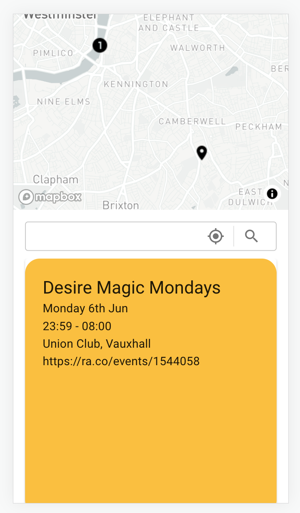

# RA Events React App



This is an API running on Node.js using Express. There is one endpoint that mainly serves the react app for user queries to return the top 10 events closest to their query.

The API should not be exposed to the internet when run and should only be available to the docker services running on the same docker network.

This is dependent on the main web scraping application here: [RA Music Events Grabber](https://github.com/hskingr/music_events_grabber)

### To Run

```
docker compose build
docker compose up
```

### Environmnet Variables

The port the express app listens on

`PORT`

Local MongoDB address

`MONGODB_CONNECTION_STRING_DEV`

Deployed MongoDB address. The docker hostname for MongoDB works here

`MONGODB_CONNECTION_STRING_PROD`
